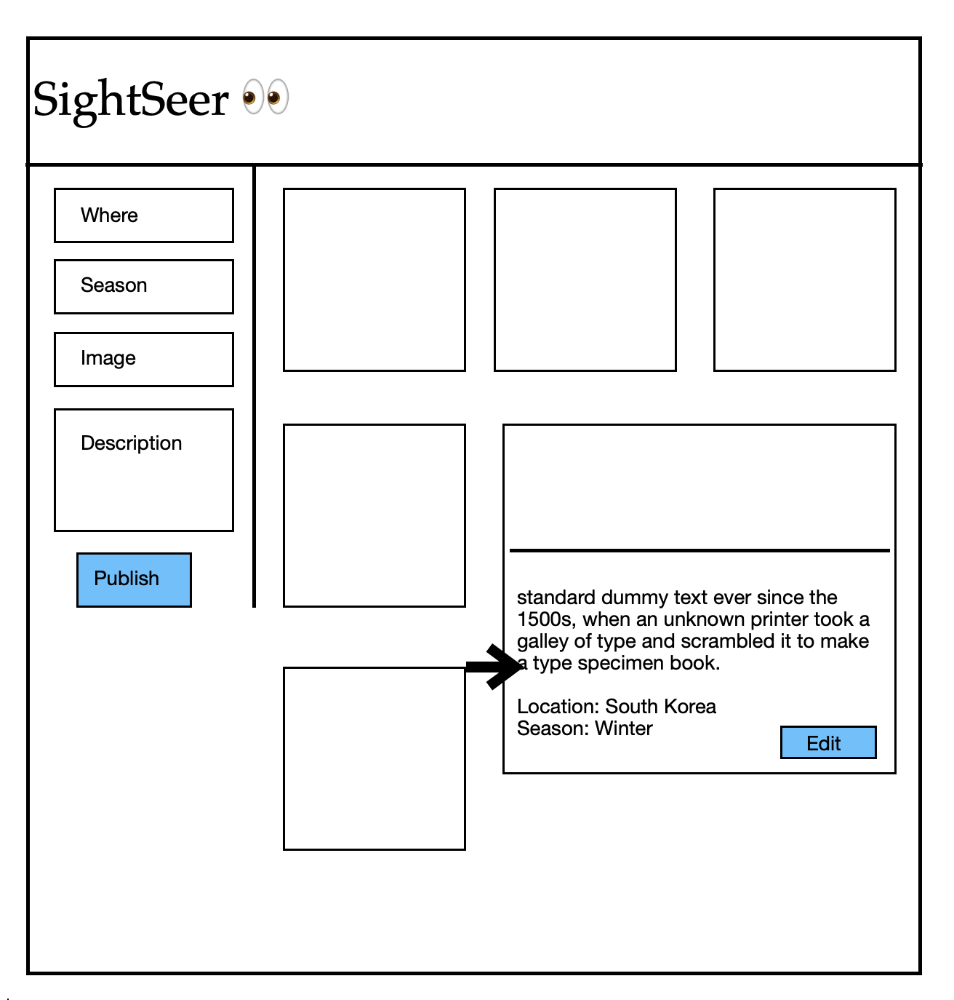

# Sightseer

## User Stories
A Blog application that aims to provide users with a platform to share details of their upcoming trips. Users will be able to post trip information, including images and descriptions.

---

## Live Link
Live demo [here](https://sightseer-backend.onrender.com/sights)

---
---
 ## Wireframe
 

---
---

### Some screenshots 

---

---
---
---
## Technologies Used
* React
* Express
* MongoDB
* Node.js
* HTML
* CSS
### Dependencies used
* Axios
* dotenv
* express
* mongoose
## Challenges faced 
* Dealing with CSS.
* Backend switching when we deploy.
* Making seed data
* update routes
* Github merge conflict

## most useful tool we relied on
* Git
* VS Code
* Slack
